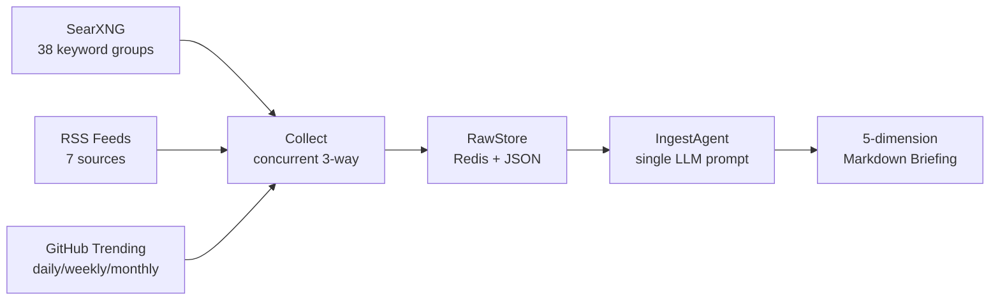

# Linglong Scout

AI information collection agent — search, RSS ingestion, LLM-powered briefing generation.


## What It Does

Linglong Scout collects, deduplicates, and synthesizes AI industry news into a structured morning briefing:



The briefing covers 5 dimensions — key people, company moves, policy, open-source trends, and real-world applications — generated by a single LLM prompt over deduplicated data.

### Example Output

```markdown
# AI Briefing 2026-05-29

## Key People
- **Andrej Karpathy** released a new tutorial on ...
- **Sam Altman** announced ...

## Company Moves
- **OpenAI** launched GPT-5 with ...

## Policy
- EU AI Act enforcement guidelines ...

## Open Source Trends
- **ai-toolkit** (+1.2k stars/week) — ...

## Applications
- **Tesla** deployed humanoid robots at ...
```

## Quick Start

```bash
# Install
pip install -e .

# Configure (copy template, fill in secrets)
cp .scout.example.yml .scout.yml

# Generate a briefing
linglong-scout brief

# Collect data only (no LLM call)
linglong-scout collect

# Start MCP server (remote deployment)
linglong-scout serve
```

## Architecture

Scout is independent from [Linglong Knowledge](https://github.com/wangxinxin/linglong-knowledge) — it collects and returns results, the user decides what to persist.

```
Data Sources → Scout (collect + summarize) → Return to conversation → User decides → Knowledge Base
```

- **7 MCP tools** — local (stdio) and remote (HTTP + Token auth) modes
- **Concurrent collection** — SearXNG / GitHub / RSS in parallel (~8s vs ~57s sequential)
- **Two-tier deduplication** — URL level + LLM-based semantic dedup across days
- **Per-user isolation** — cache, preferences, and briefings partitioned by user
- **Built-in scheduler** — daily auto-collection via asyncio, no external cron needed
- **Docker deployment** — single container, `network_mode: host`

## MCP Tools

| Tool | Description |
|------|-------------|
| `generate_brief` | Generate AI briefing (per-user cache) |
| `search_web` | Search via SearXNG |
| `fetch_rss` | Ingest an RSS/Atom feed |
| `fetch_github_trending` | GitHub trending repos (3-level fallback) |
| `fetch_raw` | Retrieve structured raw collection data |
| `execute_package` | Custom topic collection + generation |
| `record_feedback` | Record user preference (per-user, affects future briefings) |

Parameters, return formats, and examples → [MCP Tools Reference](docs/design/07-mcp-tools.md)

## Connecting to Agents

Scout exposes an MCP server. Connect from Claude Code, OpenClaw, or any MCP client:

```json
{
  "mcpServers": {
    "linglong-scout": {
      "command": "bash",
      "args": ["-c", "cd /path/to/linglong-scout && .venv/bin/python -m linglong.mcp"]
    }
  }
}
```

Remote deployment (HTTP + Token auth), Docker setup, and OpenClaw config → [MCP Integration Guide](docs/design/06-mcp.md)

## Development

```bash
# Install with dev dependencies
pip install -e ".[dev]"

# Run tests
.venv/bin/pytest

# Lint
.venv/bin/ruff check src/ tests/

# Type check
.venv/bin/mypy src/
```

## Configuration

All settings via `.scout.yml`. Secrets use `${ENV_VAR}` references.

```yaml
llm:
  llm_api_key: ""
  llm_base_url: "https://api.example.com/v1"
  llm_model: ""                    # Required

ingest:
  searxng_url: "http://localhost:8088"
  collect_schedule: "06:55"        # Daily auto-collection, empty to disable
  rss_sources:
    - name: AIHOT
      url: https://aihot.virxact.com/feed

mcp:
  transport: "stdio"               # stdio | streamable-http
  redis_url: ${REDIS_URL}
  auth_token: ${LL_MCP_AUTH_TOKEN}
```

Full template → [.scout.example.yml](.scout.example.yml)

## Documentation

- [Module overview + MCP setup](docs/README.md) — quick start, architecture, deployment
- [Design overview](docs/design/00-overview.md) — global decisions, component list, version history
- [MCP tools reference](docs/design/07-mcp-tools.md) — all 7 tools with parameters and examples

## License

MIT
