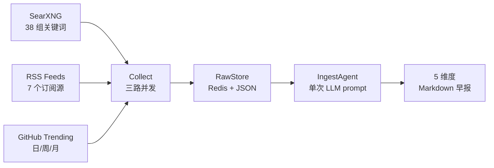

# Linglong Scout

AI 信息采集 Agent —— 搜索、RSS 抓取、LLM 摘要生成，输出结构化早报。


## 它做什么

Linglong Scout 从多源采集 AI 行业资讯，去重后由 LLM 合成为 5 维度早报：



### 示例输出

```markdown
# AI 早报 2026-05-29

## 关键人物
- **Karpathy** 发布了新教程 ...
- **Sam Altman** 宣布 ...

## 公司动态
- **OpenAI** 发布 GPT-5 ...

## 政策动态
- EU AI Act 执法指南 ...

## 开源趋势
- **ai-toolkit**（+1.2k stars/周）— ...

## 应用落地
- **Tesla** 在工厂部署人形机器人 ...
```

## 快速开始

```bash
# 安装
pip install -e .

# 配置（复制模板，填入密钥）
cp .scout.example.yml .scout.yml

# 生成早报
linglong-scout brief

# 仅采集（不调 LLM）
linglong-scout collect

# 启动 MCP 服务（远程部署）
linglong-scout serve
```

## 架构

Scout 独立于 [Linglong Knowledge](https://github.com/xinovate/linglong-knowledge) —— 采集结果返回给对话，用户决定是否入库。

```
数据源 → Scout（采集 + 摘要）→ 返回给对话 → 用户决定 → 知识库
```

- **7 个 MCP 工具** — 本地（stdio）+ 远程（HTTP + Token 认证）双模式
- **三路并发采集** — SearXNG / GitHub / RSS 并行（~8s vs 串行 ~57s）
- **双层去重** — URL 级 + LLM 语义级跨天去重
- **按用户隔离** — 缓存、偏好、早报按 user_id 分区
- **内置调度器** — asyncio 后台任务，每天自动采集，无需外部 cron
- **Docker 部署** — 单容器，`network_mode: host`

## MCP 工具

| 工具 | 说明 |
|------|------|
| `generate_brief` | 生成 AI 早报（按用户缓存） |
| `search_web` | SearXNG 搜索 |
| `fetch_rss` | 采集 RSS/Atom feed |
| `fetch_github_trending` | GitHub 趋势项目（三级 fallback） |
| `fetch_raw` | 获取结构化原始采集数据 |
| `execute_package` | 自定义主题采集 + 生成 |
| `record_feedback` | 记录用户偏好（按用户隔离，影响后续早报） |

参数、返回格式和请求示例 → [MCP 工具参考](docs/design/07-mcp-tools.md)

## 接入 Agent

Scout 暴露 MCP Server，Claude Code、OpenClaw 等客户端均可接入：

```json
{
  "mcpServers": {
    "linglong-scout": {
      "command": "bash",
      "args": ["-c", "cd /path/to/linglong-scout && .venv/bin/python -m linglong.mcp"]
    }
  }
}
```

远程部署（HTTP + Token 认证）、Docker、OpenClaw 配置 → [MCP 接入](docs/design/06-mcp.md)

## 开发

```bash
# 安装（含开发依赖）
pip install -e ".[dev]"

# 测试
.venv/bin/pytest

# 代码检查
.venv/bin/ruff check src/ tests/

# 类型检查
.venv/bin/mypy src/
```

## 配置

所有配置通过 `.scout.yml` 管理，敏感值用 `${ENV_VAR}` 引用。

```yaml
llm:
  llm_api_key: ""
  llm_base_url: "https://api.example.com/v1"
  llm_model: ""                    # 必填

ingest:
  searxng_url: "http://localhost:8088"
  collect_schedule: "06:55"        # 每天自动采集，留空禁用
  rss_sources:
    - name: AIHOT
      url: https://aihot.virxact.com/feed

mcp:
  transport: "stdio"               # stdio | streamable-http
  redis_url: ${REDIS_URL}
  auth_token: ${LL_MCP_AUTH_TOKEN}
```

完整配置模板 → [.scout.example.yml](.scout.example.yml)

## 文档

- [模块说明 + MCP 接入](docs/README.md) — 快速上手、架构、部署
- [设计总览](docs/design/00-overview.md) — 全局决策、组件表、架构演进
- [MCP 工具参考](docs/design/07-mcp-tools.md) — 7 个工具的参数和示例

## License

MIT
