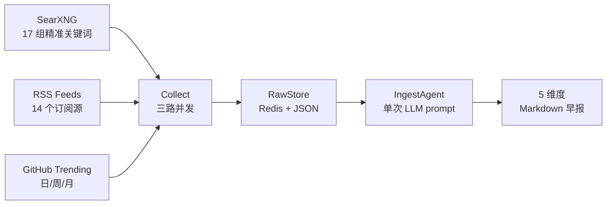
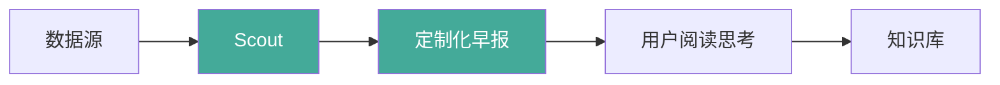

# Linglong Scout

AI 行业信息采集 Agent —— 搜索、RSS、GitHub Trending 多源并发采集，LLM 合成 5 维度结构化早报。



```mermaid
graph LR
    SearXNG["SearXNG<br/>17 组精准关键词"] --> Collect
    RSS["RSS Feeds<br/>14 个订阅源"] --> Collect
    GH["GitHub Trending<br/>日/周/月"] --> Collect
    Collect["Collect<br/>三路并发"] --> Raw["RawStore<br/>Redis + JSON"]
    Raw --> Agent["IngestAgent<br/>单次 LLM prompt"]
    Agent --> Brief["5 维度<br/>Markdown 早报"]
```

**采集 → 去重 → LLM 摘要 → 早报**，Scout 到输出结束。推送和调度由调用方处理，采集结果不自动写入知识库。


```mermaid
graph LR
    Sources["数据源"] --> Scout["Scout"]
    Scout --> Brief["定制化早报"]
    Brief --> User["用户阅读思考"]
    User --> KB["知识库"]
    style Scout fill:#4a9,color:#fff
    style Brief fill:#4a9,color:#fff
```

### 示例输出

```markdown
# AI 早报 2026-05-29

## 关键人物
- **Karpathy** 发布了新教程 ...
- **Sam Altman** 宣布 ...

## 公司动态
- **OpenAI** 发布 GPT-5 ...

## 政策动态
- EU AI Act 执法指南 ...

## 开源趋势
| 项目 | Stars 增长 | 简介 |
|------|-----------|------|
| ai-toolkit | +1.2k/周 | ... |

## 应用落地
- **Tesla** 在工厂部署人形机器人 ...
```

---

## 快速开始

### 本地开发

```bash
git clone https://github.com/xinovate/linglong-scout.git
cd linglong-scout
pip install -e .

# 配置（复制模板，填入 LLM API Key 等必填项）
cp .scout.example.yml .scout.yml

linglong-scout brief          # 生成早报
linglong-scout collect        # 仅采集，不调 LLM
linglong-scout serve          # 启动 MCP 服务（HTTP 模式需先 init）
```

stdio 模式无需认证。HTTP 模式首次使用需生成 token：

```bash
linglong-scout init           # 生成 token 写入 .env，serve (HTTP) 必需
```

### Docker 部署

所有服务（Scout + Redis + RSSHub + SearXNG）一个 `docker compose up` 启动：

```bash
git clone https://github.com/xinovate/linglong-scout.git
cd linglong-scout

# 配置
cp .scout.example.yml .scout.yml      # 编辑填入实际值
cp .env.example .env                   # 填入 API Key 和密码

# SearXNG 配置（可选）
mkdir -p config/searxng
# 将 settings.yml 放入 config/searxng/settings.yml

# 生成认证 token（HTTP 模式必需）
linglong-scout init

# 启动
docker compose up -d
docker compose logs -f scout
```

Docker 内部网络 `scout-net` 互联，仅 Scout 暴露 `127.0.0.1:9900` 到主机，Redis/RSSHub/SearXNG 仅容器内可达。

---

## 特性

- **6 个 MCP 工具** — RSS、趋势、早报生成、用户偏好
- **三路并发采集** — SearXNG / GitHub / RSS 并行（~8s vs 串行 ~57s）
- **双层去重** — URL 级 + BriefHistory 跨天语义去重
- **按用户隔离** — 缓存、偏好、早报按 user_id 分区
- **内置调度器** — asyncio 后台任务，每天自动采集 + 预生成早报
- **双模式部署** — 本地 stdio + 远程 HTTP（Token 认证）

---

## MCP 工具

| 工具 | 说明 |
|------|------|
| `generate_brief` | 生成 AI 早报（按用户缓存，预生成 fallback） |
| `fetch_rss` | 采集 RSS/Atom feed |
| `fetch_github_trending` | GitHub 趋势项目（三级 fallback） |
| `fetch_raw` | 获取结构化原始采集数据（Redis → JSON fallback） |
| `execute_package` | 自定义主题采集 + 生成 |
| `record_feedback` | 记录用户偏好（影响后续早报权重） |

参数、返回格式和请求示例 → [MCP 工具参考](docs/design/07-mcp-tools.md)

---

## 接入 Agent

Scout 暴露 MCP Server，Claude Code、OpenClaw 等客户端均可接入：

**本地 stdio：**

```json
{
  "mcpServers": {
    "linglong-scout": {
      "command": "bash",
      "args": ["-c", "cd /path/to/linglong-scout && .venv/bin/python -m linglong.mcp"]
    }
  }
}
```

**远程 HTTP：**

```json
{
  "mcpServers": {
    "linglong-scout": {
      "type": "http",
      "url": "https://your-domain/mcp/scout",
      "headers": { "Authorization": "Bearer ll-scout:username:your-token" }
    }
  }
}
```

部署架构、OpenClaw 配置、认证流程 → [MCP 接入](docs/design/06-mcp.md)

---

## 配置

所有配置通过 `.scout.yml` 管理，敏感值用 `${ENV_VAR}` 引用环境变量。HTTP 模式强制 Token 认证（`linglong-scout init` 生成），stdio 模式无需认证。

```yaml
llm:
  llm_api_key: ""
  llm_base_url: "https://api.example.com/v1"
  llm_model: ""                    # 必填

ingest:
  searxng_url: "http://localhost:8088"
  rsshub_url: "http://localhost:1200"
  collect_schedule: "06:55"        # 每天自动采集，留空禁用
  rss_sources:
    - name: AIHOT
      url: https://aihot.virxact.com/feed    # 直连 RSS
    - name: 36氪快讯
      route: /36kr/newsflashes                # RSSHub 路由

mcp:
  transport: "stdio"               # stdio | streamable-http
  redis_url: ${REDIS_URL}
  auth_token: ${LL_MCP_AUTH_TOKEN}
```

完整配置模板 → [.scout.example.yml](.scout.example.yml) | 配置字段说明 → [设计总览](docs/design/00-overview.md)

---

## 开发

```bash
pip install -e ".[dev]"            # 安装（含开发依赖）
.venv/bin/pytest                   # 测试
.venv/bin/ruff check src/ tests/   # 代码检查
.venv/bin/mypy src/                # 类型检查
```

---

## 文档

| 文档 | 说明 |
|------|------|
| [模块说明 + MCP 接入](docs/README.md) | 架构、组件、部署详解 |
| [设计总览](docs/design/00-overview.md) | 全局决策、组件表、架构演进 |
| [MCP 工具参考](docs/design/07-mcp-tools.md) | 7 个工具的参数和示例 |
| [工作日志](journal/README.md) | 按天记录开发过程 |

## License

MIT

## 交流


