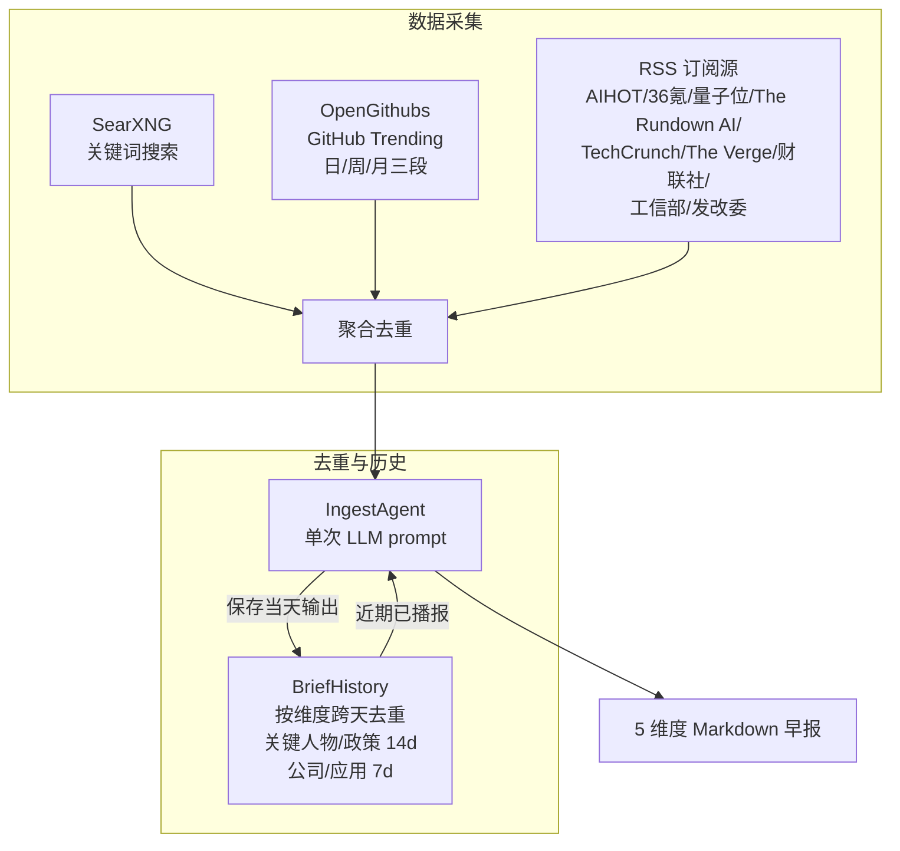

# Ingest — 信息采集助手

## 定位

**ingest 是用户的信息采集助手，不是知识库的数据入口。**

采集结果交给用户阅读和思考，有价值的内容在人与 Agent 的讨论中沉淀进知识库。未经思考的原始数据直接入库只是堆积，没有分量。

```
数据源 → ingest（采集+验证）→ 定制化信息 → 用户阅读思考 → 讨论 → 沉淀 → 知识库
                                              ↑
                                        ingest 到这里结束
```

## 信息维度

ingest 早报覆盖 AI 领域 5 个维度：

| 维度 | 典型内容 | 数据源 |
|------|---------|--------|
| 关键人物 | 观点/言论/人事变动 | SearXNG + RSS |
| 公司动态 | 产品发布、融资、股价 | SearXNG + RSS |
| 政策动态 | AI 监管、产业政策 | SearXNG + RSS |
| 开源趋势 | AI 新项目 Stars 增长 | OpenGithubs（日/周/月三段） |
| 应用落地 | 模型/Agent/机器人产品 | SearXNG + RSS |

详细的维度定义、信源实测、实现路线 → [设计总览](design/00-overview.md)

## 设计原则

1. **ingest 不写知识库** — 采集结果返回给调用方，写入由人决定
2. **ingest 不做调度** — 由调用方（OpenClaw cron / CLI / MCP）触发
3. **ingest 不做推送** — 采集后怎么展示是调用方的事
4. **LLM Agent 驱动** — 预搜索后单次 LLM prompt 直接输出 markdown（v2.0+）

## 架构（v2.0+）

v2.0 起早报生成从"代码流水线"重构为"LLM Agent 单 prompt"模式：



### 数据源

| 数据源 | 类型 | 条目/次 | 说明 |
|--------|------|---------|------|
| SearXNG | 自托管搜索 | ~160 | 38 个关键词组，中英文混合 |
| OpenGithubs | GitHub Contents API | 11 | 日 5 + 周 3 + 月 3，三级 fallback |
| AIHOT | RSS feed | ~30 | 编辑精选 AI 新闻聚合 |
| 36氪 | RSS feed | ~30 | 国内科技新闻 |
| 36氪快讯 | RSSHub | ~20 | 快讯 |
| 量子位 | RSS feed | ~10 | AI 垂直媒体 |
| The Rundown AI | RSS feed | ~20 | 英文 AI Newsletter |
| 财联社电报 | RSSHub | ~20 | 财经快讯 |
| 财联社深度 | RSSHub | ~10 | 深度报道 |
| TechCrunch AI | RSS feed | ~20 | 英文 AI 新闻 |
| The Verge AI | RSS feed | ~15 | 英文 AI 新闻 |
| 工信部文件公示 | RSSHub (gov) | ~15 | AI 大模型备案、产业政策 |
| 发改委新闻动态 | RSSHub (gov) | ~25 | 数字经济、新基建政策 |

### 去重机制

| 层级 | 范围 | 方法 |
|------|------|------|
| SearXNG 内部 | URL 去重 | `seen_urls` 集合 |
| RSS 内部 | URL 去重 | `seen_urls` 集合 |
| SearXNG ↔ RSS 交叉 | URL 去重 | RSS 排除已出现在 SearXNG 中的 URL |
| BriefHistory | 跨天语义去重 | 历史输出注入 prompt，LLM 判断是否重复 |

### 缓存机制

`generate_brief()` 支持日内缓存：当天已生成的早报直接返回，避免重复 LLM 调用。

| 配置 | 默认值 | 说明 |
|------|--------|------|
| `brief_output_dir` | `~/linglong/briefs` | 缓存目录，按日期存 `{YYYY-MM-DD}.md` |
| `brief_schedule_time` | `07:30` | 播报时段标记（如 `2026-05-25 07:30 → 2026-05-26 07:30`） |
| `brief_cache_days` | `14` | 缓存保留天数 |

## 核心组件

| 组件 | 路径 | 说明 |
|------|------|------|
| `IngestAgent` | `src/linglong_scout/ingest/agent.py` | LLM Agent：预搜索 + 单 prompt → markdown |
| `BriefHistory` | `src/linglong_scout/ingest/brief_history.py` | 按维度跨天去重 + 重叠检测 + fallback 输出 |
| `SourcePackage` | `src/linglong_scout/ingest/package.py` | 采集包定义模型（内联在 .linglong-scout.yaml） |
| `FeedbackStore` | `src/linglong_scout/ingest/feedback.py` | 用户偏好存储 + 权重计算 |
| `SourceHealth` | `src/linglong_scout/ingest/agent.py` | 信源健康监控（成功率 + 连续失败告警） |
| `company_snapshot.json` | `~/linglong/` | 中美 14 家 AI 公司融资/估值快照（外部维护） |

## MCP 工具

| 工具 | 说明 |
|------|------|
| `generate_brief()` | 读取 .linglong-scout.yaml 中第一个 package，采集 + LLM 合成 → 返回 markdown 早报 |
| `execute_package(path)` | 指定 YAML 文件路径执行采集包 |
| `fetch_rss(url)` | 采集单个 RSS feed，返回条目列表 |
| `search_web(query, max_results)` | SearXNG 搜索，返回结果列表 |
| `record_feedback(hash, feedback)` | 记录用户偏好（positive/negative），影响后续权重 |

## MCP 接入

支持两种部署模式：本地子进程（stdio）和远程服务（HTTP + Token 认证）。

### 本地部署（stdio）

#### Claude Code

在 `~/.claude/settings.json` 的对应项目下添加：

```json
{
  "mcpServers": {
    "linglong-scout": {
      "command": "bash",
      "args": ["-c", "cd /path/to/linglong-scout && .venv/bin/python -m linglong_scout.mcp"],
      "env": {
        "ZHIPU_API_KEY": "your-key",
        "SEARXNG_API_KEY": "your-key",
        "RSSHUB_ACCESS_KEY": "your-key"
      }
    }
  }
}
```

> MCP 子进程不继承 shell 环境变量，必须通过 `env` 字段注入。config.py 通过 `_PROJECT_ROOT` fallback 自动定位 `.linglong-scout.yaml`。

#### OpenClaw（本地）

在 `~/.openclaw/openclaw.json` 的 `mcp.servers` 中添加：

```json
{
  "mcp": {
    "servers": {
      "linglong-scout": {
        "command": "bash",
        "args": ["-c", "cd /path/to/linglong-scout && .venv/bin/python -m linglong_scout.mcp"]
      }
    }
  }
}
```

> OpenClaw 继承 shell 环境变量，不需要额外 `env` 字段。

### 远程部署（HTTP + Token）

将 MCP server 部署为长期运行的 HTTP 服务，Agent 远程调用。

#### 1. 服务端配置

`.linglong-scout.yaml` 切换为 HTTP 模式：

```yaml
mcp:
  transport: streamable-http
  host: "127.0.0.1"
  port: 9900
  auth_token: ${LL_MCP_AUTH_TOKEN}    # Bearer token（必须设置）
```

启动：`python -m linglong_scout.mcp`（或用 systemd 守护，参考 `deploy/linglong-scout-mcp.service`）

#### 2. OpenClaw 远程接入

```json
{
  "mcp": {
    "servers": {
      "linglong-scout": {
        "url": "http://your-server:9900/mcp",
        "transport": "streamable-http",
        "headers": {
          "Authorization": "Bearer your-secret-token"
        }
      }
    }
  }
}
```

### 已知注意事项

- `generate_brief()` 内部用 `_run_async()` (ThreadPoolExecutor) 运行 async 函数，因为 MCP server 自身有事件循环，不能嵌套 `asyncio.run()`
- RSSHub `ACCESS_KEY` 仅追加到包含 `:1200` 端口的 URL
- GitHub API 优先用 `gh auth token` 认证（5000 req/hr），未认证仅 60 req/hr

## 调用方式

```bash
# CLI — 生成早报
linglong-scout scout

# MCP — Agent 在对话中按需采集
# execute_package(path) → 查看结果 → 讨论 → 记录有价值内容
# record_feedback(hash, feedback) → 记录偏好
```

## 配置

```yaml
# .linglong-scout.yaml
ingest:
  searxng_url: http://localhost:8088

  # API Key 认证（可选，用于安全加固）
  searxng_api_key: ${SEARXNG_API_KEY}
  rsshub_access_key: ${RSSHUB_ACCESS_KEY}

  # RSS 订阅源
  rss_sources:
    - name: AIHOT
      url: https://aihot.virxact.com/feed
    - name: 36氪
      url: https://36kr.com/feed
    # ... 更多源见 .linglong-scout.example.yaml

  packages:
    - name: ai-morning-brief
      topic: AI 早报
      output:
        format: morning-brief
        persist: true
      sources:
        - id: aihot-daily
          type: aihot
          config:
            endpoint: daily
        - id: github-trending
          type: github
          config:
            topics: ["ai", "llm", "ai-agent"]
      search_queries:
        - keywords: ["OpenAI news May 2026"]
          max_results: 5
          max_age_days: 3
```

## 设计文档

- [设计总览](design/00-overview.md) — 定位、子设计索引、全局设计决策、架构演进
- [数据源架构](design/01-data-sources.md) — SearXNG/GitHub/RSS 三路并发
- [Agent 流水线](design/02-agent-pipeline.md) — 采集→去重→LLM→输出
- [去重机制](design/03-dedup.md) — URL 级 + BriefHistory 语义级
- [缓存与调度](design/04-cache.md) — 日内缓存 + 时段标记
- [Prompt 设计](design/05-prompt.md) — 模板结构 + 占位符 + 15 条规则
- [MCP 接入](design/06-mcp.md) — 双模式部署 + Token 认证
