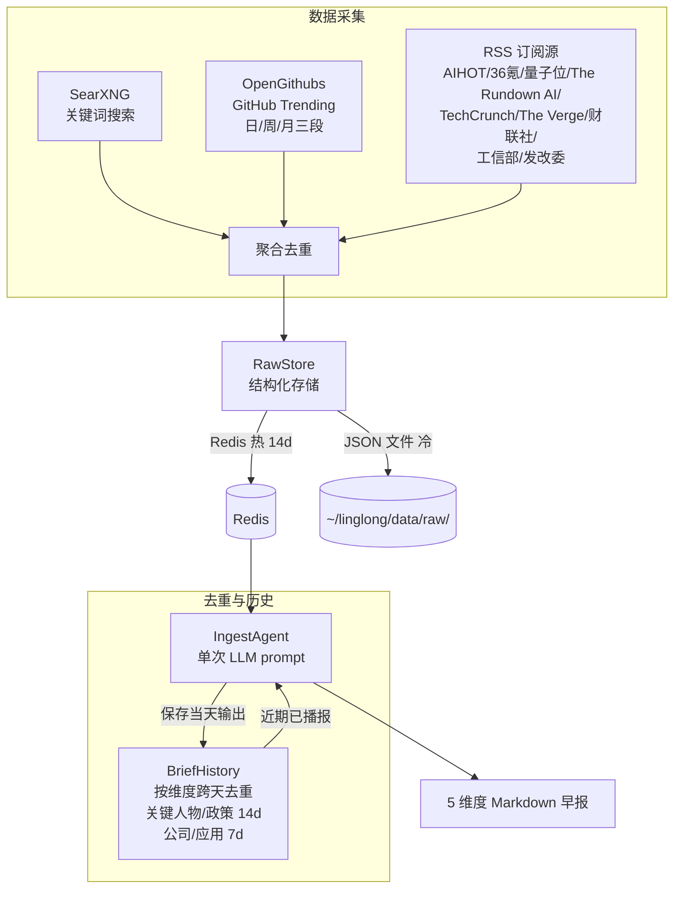

# Ingest — 信息采集助手

## 定位

**ingest 是用户的信息采集助手，不是知识库的数据入口。**

采集结果交给用户阅读和思考，有价值的内容在人与 Agent 的讨论中沉淀进知识库。未经思考的原始数据直接入库只是堆积，没有分量。

```
数据源 → ingest（采集+验证）→ 定制化信息 → 用户阅读思考 → 讨论 → 沉淀 → 知识库
                                              ↑
                                        ingest 到这里结束
```

## 信息维度

ingest 早报覆盖 AI 领域 5 个维度：

| 维度 | 典型内容 | 数据源 |
|------|---------|--------|
| 关键人物 | 观点/言论/人事变动 | SearXNG + RSS |
| 公司动态 | 产品发布、融资、股价 | SearXNG + RSS |
| 政策动态 | AI 监管、产业政策 | SearXNG + RSS |
| 开源趋势 | AI 新项目 Stars 增长 | OpenGithubs（日/周/月三段） |
| 应用落地 | 模型/Agent/机器人产品 | SearXNG + RSS |

详细的维度定义、信源实测、实现路线 → [设计总览](design/00-overview.md)

## 设计原则

1. **ingest 不写知识库** — 采集结果返回给调用方，写入由人决定
2. **ingest 不做调度** — 容器内自调度（`collect_schedule`），用户按需触发生成
3. **ingest 不做推送** — 采集后怎么展示是调用方的事
4. **LLM Agent 驱动** — 预搜索后单次 LLM prompt 直接输出 markdown（v2.0+）

## 架构（v2.0+）

v2.0 起早报生成从"代码流水线"重构为"LLM Agent 单 prompt"模式：



### 数据源

| 数据源 | 类型 | 条目/次 | 说明 |
|--------|------|---------|------|
| SearXNG | 自托管搜索 | ~160 | 38 个关键词组，中英文混合 |
| OpenGithubs | GitHub Contents API | 11 | 日 5 + 周 3 + 月 3，三级 fallback |
| AIHOT | RSS feed | ~30 | 编辑精选 AI 新闻聚合 |
| 36氪 | RSS feed | ~30 | 国内科技新闻 |
| 量子位 | RSS feed | ~10 | AI 垂直媒体 |
| The Rundown AI | RSS feed | ~20 | 英文 AI Newsletter |
| TechCrunch AI | RSS feed | ~20 | 英文 AI 新闻 |
| The Verge AI | RSS feed | ~15 | 英文 AI 新闻 |

以下源需本地 RSSHub 实例（`.scout.example.yml` 中默认注释）：

| 36氪快讯 | RSSHub | ~20 | 快讯 |
| 华尔街见闻快讯 | RSSHub | ~20 | 财经实时快讯 |
| 财新网 | RSSHub | ~15 | 深度财经报道 |
| 工信部文件公示 | RSSHub (gov) | ~15 | AI 大模型备案、产业政策 |
| 发改委新闻动态 | RSSHub (gov) | ~25 | 数字经济、新基建政策 |

### 去重机制

| 层级 | 范围 | 方法 |
|------|------|------|
| SearXNG 内部 | URL 去重 | `seen_urls` 集合 |
| RSS 内部 | URL 去重 | `seen_urls` 集合 |
| SearXNG ↔ RSS 交叉 | URL 去重 | RSS 排除已出现在 SearXNG 中的 URL |
| BriefHistory | 跨天语义去重 | 历史输出注入 prompt，LLM 判断是否重复 |

### 缓存机制

`generate_brief()` 支持日内缓存：当天已生成的早报直接从 Redis 返回，避免重复 LLM 调用。

| 配置 | 默认值 | 说明 |
|------|--------|------|
| `mcp.redis_url` | `""` | Redis 连接地址（如 `redis://localhost:6379/0`） |
| `ingest.brief_schedule_time` | `07:00` | 播报时段标记（如 `2026-05-25 07:00 → 2026-05-26 07:00`） |
| `collect_schedule` | `06:55` | 每天自动采集时间（HH:MM），留空禁用 |

Redis 数据结构：`scout:brief:{date}:{user_id}`（TTL 25h，按用户隔离）+ `scout:history:{date}`（TTL 16d）+ `scout:raw:{date}:{source}`（TTL 14d）。

## 核心组件

| 组件 | 路径 | 说明 |
|------|------|------|
| `IngestAgent` | `src/linglong/scout/agent.py` | LLM Agent：格式化 → LLM → markdown（采集逻辑在 collect.py） |
| `Collect` | `src/linglong/scout/collect.py` | 三路并发数据采集（SearXNG / GitHub / RSS） |
| `Scheduler` | `src/linglong/scout/scheduler.py` | 容器内自动采集调度（asyncio 后台任务） |
| `RawStore` | `src/linglong/scout/raw_store.py` | 结构化原始数据存储模块（Redis 热 + JSON 文件冷） |
| `BriefHistory` | `src/linglong/scout/brief_history.py` | 按维度跨天去重 + 重叠检测 + fallback 输出 |
| `SourcePackage` | `src/linglong/scout/package.py` | 采集包定义模型（内联在 .scout.yml） |
| `FeedbackStore` | `src/linglong/scout/feedback.py` | 用户偏好存储 + 权重计算（按 user_id 隔离） |
| `SourceHealth` | `src/linglong/scout/collect.py` | 信源健康监控（成功率 + 连续失败告警） |
| `company_snapshot` | Redis `scout:company_snapshot` | 中美 14 家 AI 公司融资/估值快照 |

## MCP 工具

| 工具 | 说明 |
|------|------|
| `generate_brief()` | 生成 AI 早报（缓存按用户隔离）：优先从 Redis 读 raw 数据，无则采集 → LLM 合成 |
| `fetch_raw(target_date, source)` | 获取结构化原始数据（Redis 优先 → fallback JSON 文件） |
| `execute_package(topic, keywords, name, max_results)` | 自定义参数执行采集+生成，不依赖 YAML 文件 |
| `fetch_rss(url, name, max_items)` | 采集单个 RSS feed，返回条目列表 |
| `fetch_github_trending(daily, weekly, monthly)` | GitHub 趋势项目（三级 fallback） |
| `search_web(query, max_results)` | SearXNG 搜索，返回结果列表 |
| `record_feedback(content_hash, feedback, tags)` | 记录用户偏好（按用户隔离），影响后续 generate_brief 权重 |

参数、返回格式和请求示例 → [MCP 工具参考](design/07-mcp-tools.md)

## MCP 接入

支持两种部署模式：本地子进程（stdio）和远程服务（HTTP + Token 认证）。

### 本地部署（stdio）

#### Claude Code

在 `~/.claude/settings.json` 的 `mcpServers` 中添加（本地 stdio）：

```json
{
  "mcpServers": {
    "linglong-scout": {
      "command": "bash",
      "args": ["-c", "cd /path/to/linglong-scout && .venv/bin/python -m linglong.mcp"]
    }
  }
}
```

> 敏感配置（API Key 等）放在项目目录的 `.scout.yml` 中（已 gitignore），或通过 pydantic-settings 环境变量注入（前缀 `LL_SCOUT_LLM_`、`LL_INGEST_`）。config.py 通过 `_PROJECT_ROOT` fallback 自动定位 `.scout.yml`。

#### OpenClaw（本地）

在 `~/.openclaw/openclaw.json` 的 `mcp.servers` 中添加：

```json
{
  "mcp": {
    "servers": {
      "linglong-scout": {
        "command": "bash",
        "args": ["-c", "cd /path/to/linglong-scout && .venv/bin/python -m linglong.mcp"]
      }
    }
  }
}
```

> OpenClaw 继承 shell 环境变量，不需要额外 `env` 字段。

### 远程部署（HTTP + Token）

将 MCP server 部署为长期运行的 HTTP 服务，Agent 远程调用。

#### 1. 服务端配置

`.scout.yml` 切换为 HTTP 模式：

```yaml
mcp:
  transport: streamable-http
  host: "127.0.0.1"
  port: 9900
  redis_url: ${REDIS_URL}             # Redis 验证 token
```

启动：`python -m linglong.mcp`（或用 Docker 部署，见下文）

#### 2. Claude Code 远程接入

在 `~/.claude/settings.json` 的 `mcpServers` 中添加：

```json
{
  "mcpServers": {
    "linglong-scout": {
      "type": "http",
      "url": "https://your-domain/mcp/scout",
      "headers": {
        "Authorization": "Bearer ll-scout:username:your-token"
      }
    }
  }
}
```

#### 3. OpenClaw 远程接入

```json
{
  "mcp": {
    "servers": {
      "linglong-scout": {
        "url": "https://your-domain/mcp/scout",
        "transport": "streamable-http",
        "headers": {
          "Authorization": "Bearer ll-scout:username:your-token"
        }
      }
    }
  }
}
```

### Docker 部署

用于服务器部署，`network_mode: host` 共享主机网络，直接访问 SearXNG/RSSHub/Redis。

#### 1. 准备配置文件

```bash
# 服务器端配置模板
cp .scout.example.yml .scout.yml
# 编辑 .scout.yml，确认 RSS 源和搜索关键词

# 环境变量（pydantic-settings 自动映射，覆盖 .scout.yml 中的值）
# LLM
echo "LL_SCOUT_LLM_API_KEY=your-llm-key" > .env
echo "LL_SCOUT_LLM_BASE_URL=https://api.example.com/v1" >> .env
echo "LL_SCOUT_LLM_MODEL=gpt-4o" >> .env
# SearXNG
echo "LL_INGEST_SEARXNG_URL=http://localhost:8088" >> .env
echo "SEARXNG_API_KEY=your-key" >> .env
# RSSHub
echo "RSSHUB_ACCESS_KEY=your-key" >> .env
# Redis
echo "REDIS_URL=redis://:password@127.0.0.1:6379/0" >> .env
# MCP Token
echo "LL_MCP_AUTH_TOKEN=your-token" >> .env
```

`LL_SCOUT_LLM_*` 和 `LL_INGEST_*` 由 pydantic-settings 映射到配置字段（如 `LL_SCOUT_LLM_BASE_URL` → `llm.llm_base_url`）。`.scout.yml` 中 `${VAR}` 形式的引用（如 `${REDIS_URL}`）由 YAML 插值加载。

#### 2. 构建并启动

```bash
docker compose build
docker compose up -d
```

#### 3. 验证

```bash
docker compose ps
docker compose logs -f
curl -s -o /dev/null -w "%{http_code}" http://127.0.0.1:9900/mcp/scout
```

### 已知注意事项

- 所有 MCP 工具函数均为 `async def`，FastMCP 原生支持异步，无需线程池包装
- RSSHub `ACCESS_KEY` 仅追加到包含 `:1200` 端口的 URL
- GitHub API 优先用 `gh auth token` 认证（5000 req/hr），未认证仅 60 req/hr
- Docker 容器内无 `gh` CLI，GitHub API 调用将无认证（60 req/hr 限制）

## 调用方式

```bash
# CLI — 生成早报（手动触发）
linglong-scout brief          # 有缓存直接返回
linglong-scout brief --force  # 强制重新生成

# CLI — 仅采集不调 LLM
linglong-scout collect

# CLI — 手动运行采集包
linglong-scout scout

# CLI — 启动 MCP 服务
linglong-scout serve

# MCP — Agent 在对话中按需采集
# fetch_raw(date, source) → 查看原始结构化数据
# generate_brief() → 生成早报（有 raw 数据则跳过采集，缓存按用户隔离）
# execute_package(topic, keywords) → 自定义主题采集+生成
# record_feedback(hash, feedback) → 记录偏好（按用户隔离，影响 generate_brief）
```

### 日志

CLI 和 MCP 入口统一使用 RotatingFileHandler（5MB × 3 备份），日志路径 `~/linglong/logs/scout.log`。CLI 加 `-v` 切换 DEBUG 级别。

## 配置

```yaml
# .scout.yml — 完整配置见 .scout.example.yml
llm:
  llm_api_key: ""                           # 或设 LL_SCOUT_LLM_API_KEY
  llm_base_url: "https://api.example.com/v1"
  llm_model: "gpt-4o"

ingest:
  searxng_url: http://localhost:8088
  searxng_api_key: ${SEARXNG_API_KEY}
  rsshub_access_key: ${RSSHUB_ACCESS_KEY}

  brief_schedule_time: "07:00"
  collect_schedule: "06:55"                 # 留空禁用自动采集

  rss_sources:
    - name: AIHOT
      url: https://aihot.virxact.com/feed
    - name: 36氪
      url: https://36kr.com/feed

  packages:
    - name: ai-morning-brief
      topic: AI 早报
      search_queries:
        - keywords: ["OpenAI news May 2026"]
          max_results: 5

mcp:
  transport: "stdio"                        # stdio | streamable-http
  redis_url: ${REDIS_URL}
  auth_token: ${LL_MCP_AUTH_TOKEN}
```

## 设计文档

- [设计总览](design/00-overview.md) — 定位、子设计索引、全局设计决策、架构演进
- [数据源架构](design/01-data-sources.md) — SearXNG/GitHub/RSS 三路并发
- [Agent 流水线](design/02-agent-pipeline.md) — 采集→去重→LLM→输出
- [去重机制](design/03-dedup.md) — URL 级 + BriefHistory 语义级
- [缓存与调度](design/04-cache.md) — 日内缓存 + 时段标记
- [Prompt 设计](design/05-prompt.md) — 模板结构 + 占位符 + 15 条规则
- [MCP 接入](design/06-mcp.md) — 双模式部署 + Token 认证
- [MCP 工具参考](design/07-mcp-tools.md) — 7 个工具的参数、返回格式和请求示例
