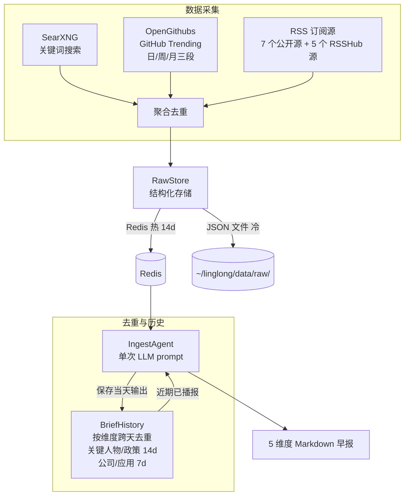

# Scout — 信息采集助手

## 定位

**Scout 是用户的信息采集助手，不是知识库的数据入口。**

采集结果交给用户阅读和思考，有价值的内容在人与 Agent 的讨论中沉淀进知识库。未经思考的原始数据直接入库只是堆积，没有分量。

```
数据源 → Scout（采集+验证）→ 定制化信息 → 用户阅读思考 → 讨论 → 沉淀 → 知识库
                                              ↑
                                        Scout 到这里结束
```

## 信息维度

Scout 早报覆盖 AI 领域 5 个维度：

| 维度 | 典型内容 | 数据源 |
|------|---------|--------|
| 关键人物 | 观点/言论/人事变动 | SearXNG + RSS |
| 公司动态 | 产品发布、融资、股价 | SearXNG + RSS |
| 政策动态 | AI 监管、产业政策 | SearXNG + RSS |
| 开源趋势 | AI 新项目 Stars 增长 | OpenGithubs（日/周/月三段） |
| 应用落地 | 模型/Agent/机器人产品 | SearXNG + RSS |

详细的维度定义、信源实测、实现路线 → [设计总览](design/00-overview.md)

## 设计原则

1. **Scout 不写知识库** — 采集结果返回给调用方，写入由人决定
2. **Scout 不做调度** — 容器内自调度（`collect_schedule`），用户按需触发生成
3. **Scout 不做推送** — 采集后怎么展示是调用方的事
4. **LLM Agent 驱动** — 预搜索后单次 LLM prompt 直接输出 markdown（v2.0+）

## 架构（v2.0+）

v2.0 起早报生成从"代码流水线"重构为"LLM Agent 单 prompt"模式：



数据源详情 → [数据源架构](design/01-data-sources.md) | 去重机制 → [去重机制](design/03-dedup.md) | 缓存策略 → [缓存与调度](design/04-cache.md)

## 核心组件

| 组件 | 路径 | 说明 |
|------|------|------|
| `IngestAgent` | `src/linglong/scout/agent.py` | LLM Agent：格式化 → LLM → markdown（采集逻辑在 collect.py） |
| `Collect` | `src/linglong/scout/collect.py` | 三路并发数据采集（SearXNG / GitHub / RSS） |
| `Scheduler` | `src/linglong/scout/scheduler.py` | 容器内自动采集调度（asyncio 后台任务） |
| `RawStore` | `src/linglong/scout/raw_store.py` | 结构化原始数据存储模块（Redis 热 + JSON 文件冷） |
| `BriefHistory` | `src/linglong/scout/brief_history.py` | 按维度跨天去重 + 重叠检测 + fallback 输出 |
| `FeedbackStore` | `src/linglong/scout/feedback.py` | 用户偏好存储 + 权重计算（按 user_id 隔离，server 单例） |
| `ScoutError` | `src/linglong/scout/exceptions.py` | Domain 异常层级（`ScoutError` / `LLMError` / `SourceError`） |

完整组件表 → [设计总览](design/00-overview.md)

## MCP 工具

| 工具 | 说明 |
|------|------|
| `generate_brief()` | 生成 AI 早报（缓存按用户隔离） |
| `fetch_raw(target_date, source)` | 获取结构化原始数据（Redis → fallback JSON 文件） |
| `execute_package(topic, keywords)` | 自定义参数执行采集+生成 |
| `fetch_rss(url, name, max_items)` | 采集单个 RSS feed |
| `fetch_github_trending(daily, weekly, monthly)` | GitHub 趋势项目（三级 fallback） |
| `search_web(query, max_results)` | SearXNG 搜索 |
| `record_feedback(content_hash, feedback, tags)` | 记录用户偏好（按用户隔离，影响后续 generate_brief 权重） |

参数、返回格式和请求示例 → [MCP 工具参考](design/07-mcp-tools.md)

## MCP 接入

支持两种部署模式：本地子进程（stdio）和远程服务（HTTP + Token 认证）。

**本地 Claude Code：**

```json
{
  "mcpServers": {
    "linglong-scout": {
      "command": "bash",
      "args": ["-c", "cd /path/to/linglong-scout && .venv/bin/python -m linglong.mcp"]
    }
  }
}
```

**远程 HTTP：**

```json
{
  "mcpServers": {
    "linglong-scout": {
      "type": "http",
      "url": "https://your-domain/mcp/scout",
      "headers": { "Authorization": "Bearer ll-scout:username:your-token" }
    }
  }
}
```

OpenClaw 配置、Docker 部署、认证流程 → [MCP 接入](design/06-mcp.md)

## CLI 命令

```bash
linglong-scout brief          # 生成早报（有缓存直接返回）
linglong-scout brief --force  # 强制重新生成
linglong-scout collect        # 仅采集，不调 LLM
linglong-scout scout          # 手动运行采集包
linglong-scout serve          # 启动 MCP 服务
```

CLI 加 `-v` 切换 DEBUG 日志。日志路径 `~/linglong/logs/scout.log`（5MB × 3 备份）。

## 配置

所有配置通过 `.scout.yml` 管理，敏感值用 `${ENV_VAR}` 引用。

```yaml
llm:
  llm_api_key: ""
  llm_base_url: "https://api.example.com/v1"
  llm_model: ""                            # 必填
ingest:
  searxng_url: "http://localhost:8088"
  collect_schedule: "06:55"                # 留空禁用自动采集
  rss_sources:
    - name: AIHOT
      url: https://aihot.virxact.com/feed
mcp:
  transport: "stdio"                       # stdio | streamable-http
  redis_url: ${REDIS_URL}
  auth_token: ${LL_MCP_AUTH_TOKEN}
```

完整配置模板 → [.scout.example.yml](../.scout.example.yml) | 配置字段说明 → [设计总览](design/00-overview.md)

## 设计文档

| 文档 | 说明 |
|------|------|
| [设计总览](design/00-overview.md) | 定位、全局决策、组件表、架构演进 |
| [数据源架构](design/01-data-sources.md) | SearXNG/GitHub/RSS 三路并发 |
| [Agent 流水线](design/02-agent-pipeline.md) | 采集→去重→LLM→输出 |
| [去重机制](design/03-dedup.md) | URL 级 + BriefHistory 语义级 |
| [缓存与调度](design/04-cache.md) | 日内缓存 + 时段标记 + 自动调度 |
| [Prompt 设计](design/05-prompt.md) | 模板结构 + 占位符 + 规则 |
| [MCP 接入](design/06-mcp.md) | 双模式部署 + Token 认证 + Docker |
| [MCP 工具参考](design/07-mcp-tools.md) | 7 个工具的参数、返回格式和请求示例 |
