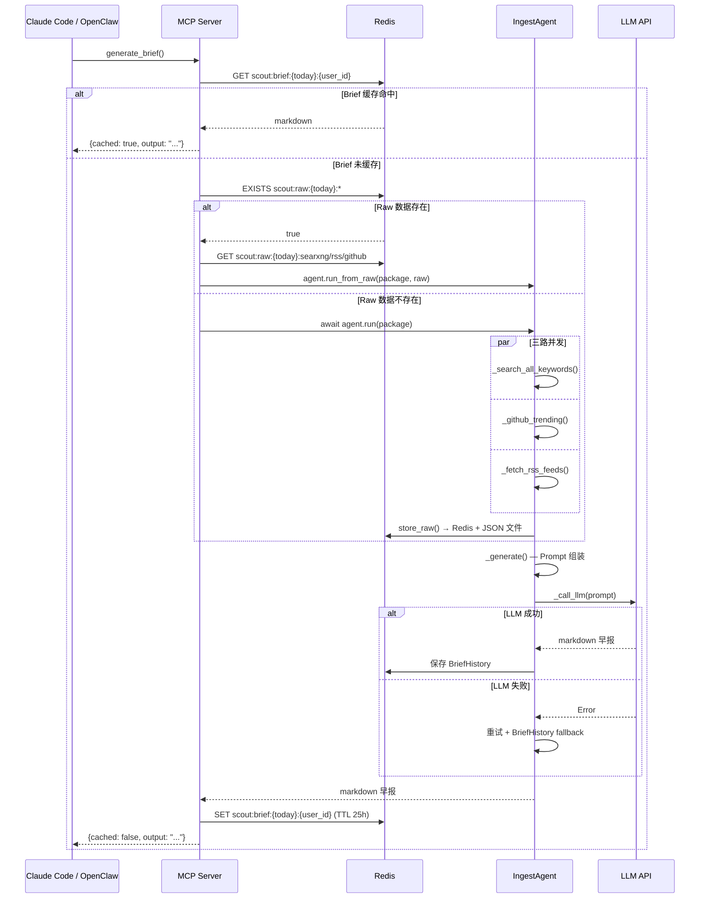

# D-02 Agent 流水线

> 状态：✅ 已实现 | 最后更新：2026-05-29 | 依赖：[D-01 数据源](01-data-sources.md)

---

## 概述

`IngestAgent` 将采集与加工解耦：`collect.py` 负责三路并发数据采集，`agent.py` 负责格式化 + LLM 生成。MCP server 启动时自动运行 `scheduler.py` 后台任务，每天按 `collect_schedule` 时间采集原始数据。

---

## 完整流程图

```mermaid
flowchart TD
    START([IngestAgent.run]) --> COLLECT["collect.collect()<br/>三路并发采集"]
        direction TB
        PARALLEL["asyncio.gather"]
        S1["SearXNG<br/>关键词搜索<br/>Semaphore(5)"]
        S2["GitHub Trending<br/>日/周/月<br/>三级 fallback"]
        S3["RSS 11 源<br/>Semaphore(3)"]
    end

    COLLECT --> DEDUP

    subgraph COLLECT_MODULE["collect.py — 三路并发"]
        direction TB
        PARALLEL["asyncio.gather"]
        S1["SearXNG<br/>关键词搜索<br/>Semaphore(5)"]
        S2["GitHub Trending<br/>日/周/月<br/>三级 fallback"]
        S3["RSS 11 源<br/>Semaphore(3)"]
    end

    subgraph DEDUP["URL 去重"]
        D1["SearXNG seen_urls 去重"]
        D2["RSS seen_urls 去重"]
        D3["RSS 排除 SearXNG 已有 URL"]
    end

    DEDUP --> STORE["store_raw()<br/>Redis 热 14d + JSON 文件冷"]

    STORE --> GEN["_generate()"]

    subgraph BUILD["Prompt 组装"]
        B1["加载 morning_brief.md 模板"]
        B2["注入占位符"]
        B3["{search_results}<br/>{github_data}<br/>{rss_data}<br/>{company_snapshot}<br/>{history_section}<br/>..."]
    end

    GEN --> BUILD --> LLM

    subgraph LLM["LLM 调用"]
        L1["_call_llm(prompt)"]
        L2{成功?}
        L3["重试 (最多 2 次)"]
    end

    L1 --> L2
    L2 -->|是| SAVE
    L2 -->|否| L3
    L3 --> L1
    L3 -->|仍失败| FALLBACK["BriefHistory fallback<br/>返回历史输出"]

    SAVE["保存 BriefHistory"] --> OUTPUT(["返回 markdown 早报"])

    style S1 fill:#4CAF50,color:#fff
    style S2 fill:#2196F3,color:#fff
    style S3 fill:#FF9800,color:#fff
    style STORE fill:#00BCD4,color:#fff
    style L1 fill:#9C27B0,color:#fff
    style FALLBACK fill:#f44336,color:#fff
```

---

## MCP 调用流程（generate_brief）



---

## LLM 配置

| 配置 | 值 | 说明 |
|------|---|------|
| model | glm-5.1 | 智谱旗舰模型 |
| base_url | `https://open.bigmodel.cn/api/anthropic` | Anthropic 兼容端点 |
| max_tokens | 8000 | 输出上限 |
| timeout | 120s | 单次调用超时 |
| retries | 2 | 失败重试次数 |

`_call_llm()` 从 config 读 base_url（非硬编码），支持切换模型和端点。

---

## 时段标记

```python
schedule_time = config.ingest.brief_schedule_time  # "07:00"
time_range = f"{(date.today() - timedelta(days=1)).isoformat()} {schedule_time} → {today} {schedule_time}"
```

输出：`> 播报时段：2026-05-25 07:00 → 2026-05-26 07:00`

---

## 容错

| 失败点 | 处理方式 |
|--------|---------|
| 单个 SearXNG 查询 | log warning，返回空列表，不阻断整批 |
| 单个 RSS 源 | log warning，跳过该源 |
| GitHub Trending | 三级 fallback（OpenGithubs → HTML → Search API） |
| LLM 调用 | 重试 2 次，仍失败则 BriefHistory fallback |

---

## 关键文件

| 文件 | 说明 |
|------|------|
| `src/linglong/scout/agent.py` | `IngestAgent.run()` + `run_from_raw()` + `_generate()` |
| `src/linglong/scout/collect.py` | 三路并发采集：`collect()` + `SourceHealth` |
| `src/linglong/scout/scheduler.py` | 容器内自动采集调度 |
| `src/linglong/scout/raw_store.py` | 结构化原始数据存储（Redis 热 + JSON 冷） |
| `src/linglong/scout/prompts/morning_brief.md` | 早报 prompt 模板 |
| `src/linglong/config.py` | `IngestConfig` 配置模型 |
| `src/linglong/mcp/tools.py` | `generate_brief()` 缓存 + raw 路径逻辑 |
