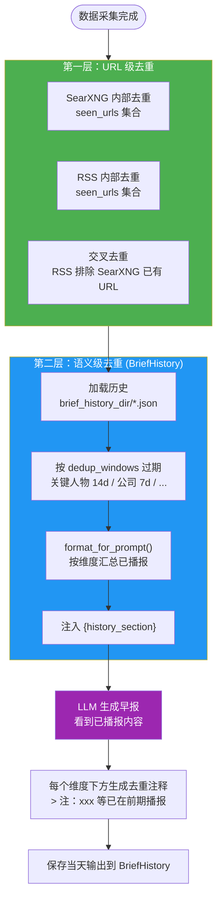
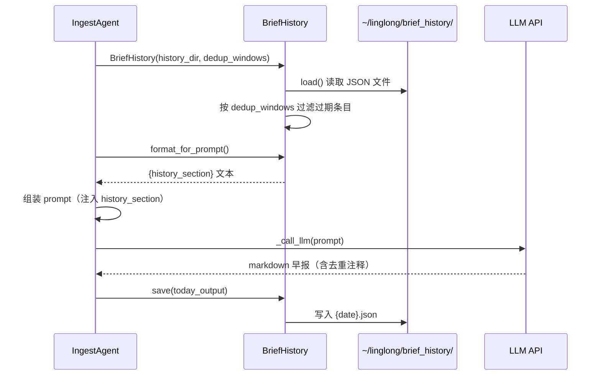

# D-03 去重机制

> 状态：✅ 已实现 | 最后更新：2026-05-26 | 依赖：[D-02 Agent 流水线](02-agent-pipeline.md)

---

## 概述

ingest 的去重分两层：URL 级（代码去重）和语义级（LLM 通过 BriefHistory 判断）。

---

## 去重流程图



---

## 去重层级

| 层级 | 范围 | 方法 | 实现 |
|------|------|------|------|
| SearXNG 内部 | URL 级 | `seen_urls` 集合 | agent.py |
| RSS 内部 | URL 级 | `seen_urls` 集合 | agent.py |
| SearXNG ↔ RSS 交叉 | URL 级 | RSS 排除 SearXNG 已出现的 URL | agent.py |
| BriefHistory 跨天 | 语义级 | 历史输出注入 prompt，LLM 判断 + 去重注释 | brief_history.py |

---

## BriefHistory 去重窗口

每个维度有独立的回看天数：

| 维度 | 默认窗口 | 原因 |
|------|----------|------|
| 关键人物 | 14 天 | 人物观点短期不变 |
| 公司动态 | 7 天 | 事件更新频率高 |
| 政策动态 | 14 天 | 政策周期较长 |
| 应用落地 | 7 天 | 产品更新频率高 |
| 开源趋势 | 不去重 | trending 项目自然变化 |

配置路径：`ingest.dedup_windows`，历史文件存储在 `~/linglong/brief_history/`。

---

## BriefHistory 时序图



---

## 重叠检测

BriefHistory 提供 `check_overlap(new_content)` 方法，检测新生成的早报与历史输出的重叠率。LLM 失败时触发 fallback：直接返回历史输出。

---

## 配置外部化

所有去重参数通过 `.scout.yml` 管理：

```yaml
ingest:
  brief_history_dir: ~/linglong/brief_history
  dedup_windows:
    关键人物: 14
    公司动态: 7
    政策动态: 14
    应用落地: 7
```

---

## 关键文件

| 文件 | 说明 |
|------|------|
| `src/linglong_scout/ingest/brief_history.py` | BriefHistory 类 |
| `src/linglong_scout/ingest/agent.py` | URL 去重逻辑 |
