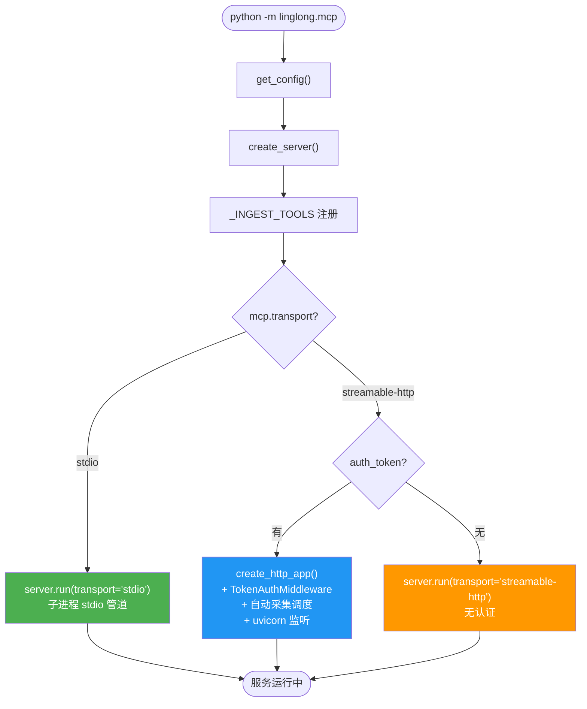
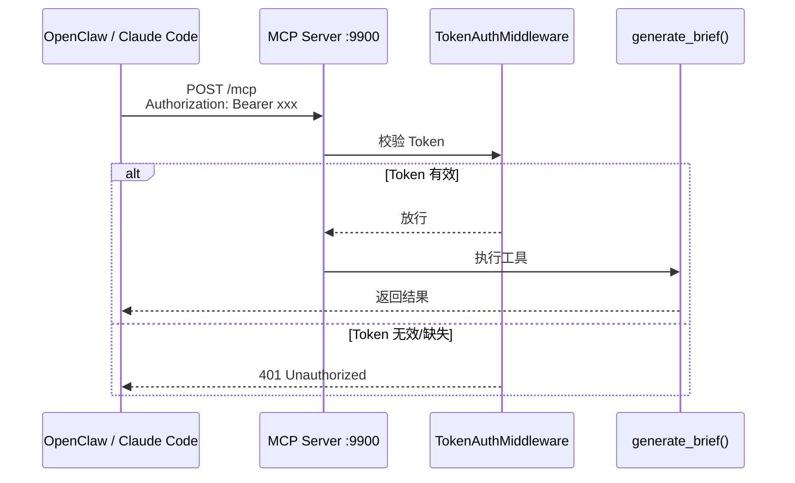
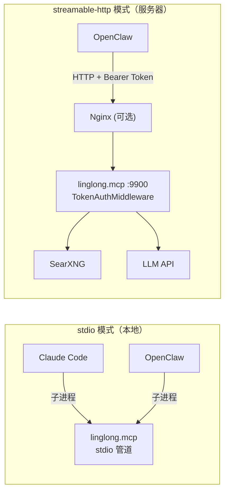
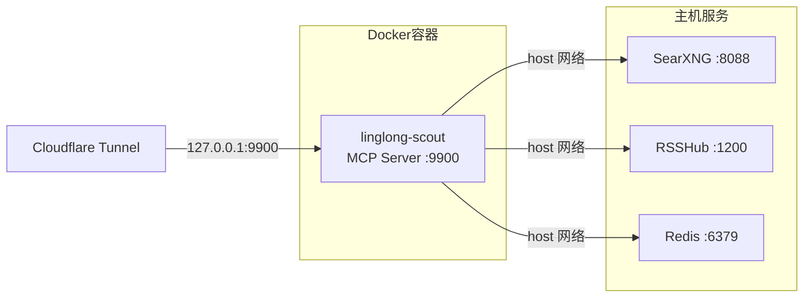

# D-06 MCP 接入

> 状态：✅ 已实现 | 最后更新：2026-05-29 | 依赖：[D-02 Agent 流水线](02-agent-pipeline.md)

---

## 概述

Linglong Scout 通过 MCP Server 暴露采集工具，同时提供 CLI 命令供 cron 调用。支持本地（stdio）和远程（streamable-http）两种接入方式。

---

## 启动流程图



---

## HTTP 请求认证流程



---

## 工具列表（7 个）

| 工具 | 说明 |
|------|------|
| `generate_brief()` | 生成 AI 早报（缓存按用户隔离） |
| `fetch_raw(date, source)` | 获取结构化原始数据（Redis → fallback 文件） |
| `execute_package(topic, keywords)` | 自定义参数执行采集+生成 |
| `fetch_github_trending(daily, weekly, monthly)` | GitHub 趋势项目（三级 fallback） |
| `fetch_rss(url)` | 采集单个 RSS feed |
| `search_web(query)` | SearXNG 搜索 |
| `record_feedback(hash, feedback)` | 记录用户偏好 |

---

## 双模式部署架构



### Docker 部署

服务器端用 Docker 容器替换 systemd + venv，`network_mode: host` 共享主机网络。



配置文件：
- `.scout.yml` — 服务器端配置（`deploy/.scout.yml.example`），敏感值用 `${ENV_VAR}` 引用
- `.env` — 环境变量（`deploy/.env.example`），包含 API Key、Token、Redis URL
- `docker-compose.yml` — `network_mode: host`，挂载 `.scout.yml` 和 `data/` 目录

---

## CLI 命令

除了 MCP 工具，还提供 CLI 命令供 cron 和手动调用：

```bash
# 生成早报（供 cron 触发）
linglong-scout brief          # 有缓存则直接返回
linglong-scout brief --force  # 强制重新生成

# 手动运行采集包
linglong-scout scout

# 启动 MCP 服务
linglong-scout serve
```

`brief` 命令的缓存逻辑：检查 Redis `scout:brief:{date}:{user_id}`，命中则直接输出，未命中则完整采集 + LLM 生成后写入 Redis（TTL 25h）。

---

## 日志

CLI 和 MCP 入口统一使用 `setup_logging()`（定义在 `config.py`）：

- RotatingFileHandler：5MB × 3 备份，写入 `~/linglong/logs/scout.log`
- StreamHandler：同时输出到 stderr
- CLI `-v` 参数可切换为 DEBUG 级别

---

## 已知注意事项

- 所有 MCP 工具函数均为 `async def`，FastMCP 原生支持异步，无需线程池包装
- `record_feedback()` 按 token 中的 user_id 隔离，仅影响对应用户的 `generate_brief()` 权重
- RSSHub `ACCESS_KEY` 仅追加到 `:1200` 端口的 URL
- GitHub API 优先用 `gh auth token` 认证（5000 req/hr）
- MCP 子进程不继承 shell 环境变量，Claude Code 需通过 `env` 字段注入

---

## 关键文件

| 文件 | 说明 |
|------|------|
| `src/linglong/mcp/server.py` | FastMCP 工厂 + 工具注册（7 个） |
| `src/linglong/mcp/__main__.py` | 按 transport 启动 + 自动采集调度 |
| `src/linglong/mcp/_auth.py` | Token 认证中间件 |
| `src/linglong/mcp/tools.py` | 7 个 MCP 工具实现 |
| `src/linglong/scout/raw_store.py` | 结构化原始数据存储（Redis 热 + JSON 冷） |
| `src/linglong/cli.py` | CLI 入口：brief / collect / scout / serve |
| `src/linglong/config.py` | 配置模型 + `setup_logging()` |
| `Dockerfile` | Python 3.12-slim，pip install |
| `docker-compose.yml` | network_mode: host，挂载配置和数据 |
