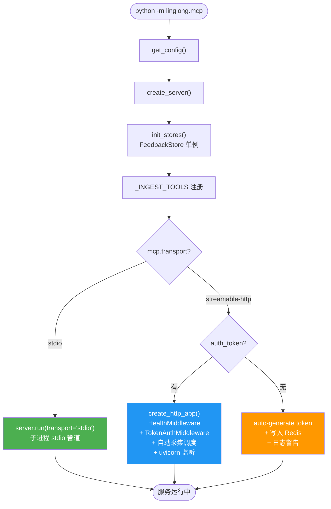
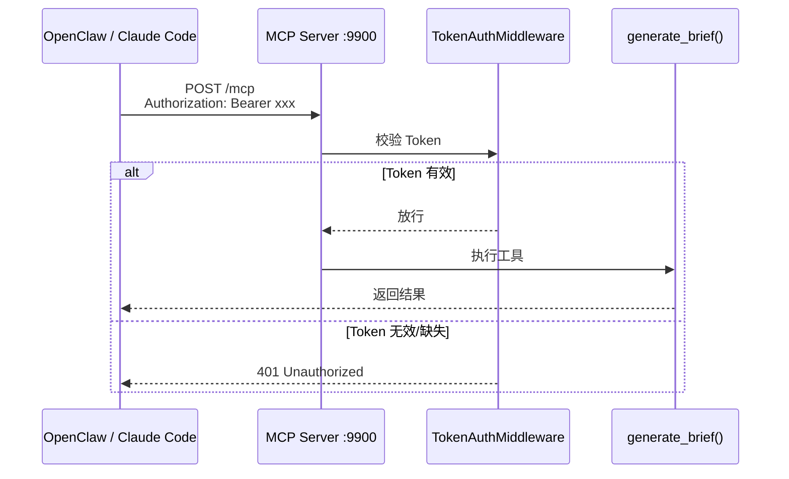
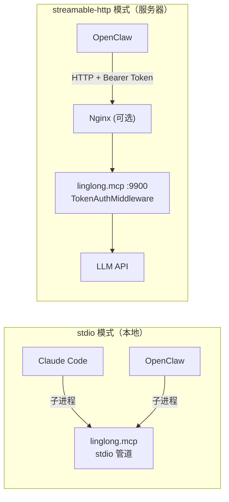
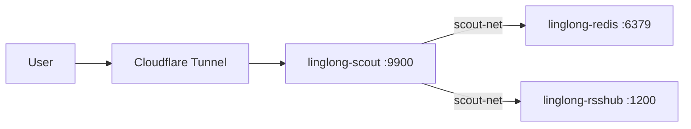

# D-06 MCP 接入

> 状态：✅ 已实现 | 最后更新：2026-06-08 | 依赖：[D-02 Agent 流水线](02-agent-pipeline.md)
> 属于 [D-00 设计总览](00-overview.md) 的接入层子设计。工具参数详见 [D-07 MCP 工具参考](07-mcp-tools.md)。

---

## 概述

Linglong Scout 通过 MCP Server 暴露采集工具，同时提供 CLI 命令供 cron 调用。支持本地（stdio）和远程（streamable-http）两种接入方式。

---

## 启动流程图


```mermaid
flowchart TD
    START(["python -m linglong.mcp"]) --> CONFIG["get_config()"]
    CONFIG --> CREATE["create_server()"]
    CREATE --> INIT["init_stores()<br/>FeedbackStore 单例"]
    INIT --> REGISTER["_INGEST_TOOLS 注册"]
    REGISTER --> TRANSPORT{mcp.transport?}

    TRANSPORT -->|stdio| STDIO["server.run(transport='stdio')<br/>子进程 stdio 管道"]
    TRANSPORT -->|streamable-http| HTTP_CHECK{auth_token?}

    HTTP_CHECK -->|有| HTTP_AUTH["create_http_app()<br/>HealthMiddleware<br/>+ TokenAuthMiddleware<br/>+ 自动采集调度<br/>+ uvicorn 监听"]
    HTTP_CHECK -->|无| HTTP_AUTO["auto-generate token<br/>+ 写入 Redis<br/>+ 日志警告"]

    STDIO --> RUNNING(["服务运行中"])
    HTTP_AUTH --> RUNNING
    HTTP_AUTO --> RUNNING

    style STDIO fill:#4CAF50,color:#fff
    style HTTP_AUTH fill:#2196F3,color:#fff
    style HTTP_AUTO fill:#FF9800,color:#fff
```

---

## HTTP 请求认证流程


```mermaid
sequenceDiagram
    participant Agent as OpenClaw / Claude Code
    participant Server as MCP Server :9900
    participant Auth as TokenAuthMiddleware
    participant Tool as generate_brief()

    Agent->>Server: POST /mcp<br/>Authorization: Bearer xxx
    Server->>Auth: 校验 Token
    alt Token 有效
        Auth-->>Server: 放行
        Server->>Tool: 执行工具
        Tool-->>Agent: 返回结果
    else Token 无效/缺失
        Auth-->>Agent: 401 Unauthorized
    end
```

---

## 工具列表（6 个）

| 工具 | 说明 |
|------|------|
| `generate_brief()` | 生成 AI 早报（缓存按用户隔离） |
| `fetch_raw(target_date, source)` | 获取结构化原始数据（Redis → fallback 文件） |
| `execute_package(topic, name)` | 自定义参数执行采集+生成 |
| `fetch_github_trending(daily, weekly, monthly)` | GitHub 趋势项目（三级 fallback） |
| `fetch_rss(url, name?, max_items?)` | 采集单个 RSS feed |
| `record_feedback(content_hash, feedback, tags)` | 记录用户偏好 |

---

## 双模式部署架构


```mermaid
graph LR
    subgraph 本地["stdio 模式（本地）"]
        CC["Claude Code"] -->|子进程| MCP1["linglong.mcp<br/>stdio 管道"]
        OC["OpenClaw"] -->|子进程| MCP1
    end

    subgraph 远程["streamable-http 模式（服务器）"]
        OC2["OpenClaw"] -->|HTTP + Bearer Token| NGINX["Nginx (可选)"]
        NGINX --> MCP2["linglong.mcp :9900<br/>TokenAuthMiddleware"]
        MCP2 --> LLM["LLM API"]
    end
```

### Docker 部署

所有服务（scout + redis + rsshub）运行在统一的 `docker-compose.yml` 中，通过 Docker 内部网络 `scout-net` 互联。


```mermaid
graph LR
    User --> CF[Cloudflare Tunnel]
    CF --> Scout[linglong-scout :9900]
    Scout -->|scout-net| Redis[linglong-redis :6379]
    Scout -->|scout-net| RSSHub[linglong-rsshub :1200]
```

- 3 个服务在同一个 `docker-compose.yml` 中，Docker 内部网络 `scout-net` 互联
- Scout 通过 Docker 服务名访问其他服务（`http://rsshub:1200`、`redis://redis:6379/0`）
- 仅 scout 暴露 `127.0.0.1:9900` 到主机，其余服务仅容器内可达
- 配置文件：`.scout.yml`、`.env`
- 数据卷：`./data`（日志 + 原始数据 + Redis 持久化）

---

## CLI 命令

除了 MCP 工具，还提供 CLI 命令供 cron 和手动调用：

```bash
# 生成早报（供 cron 触发）
linglong-scout brief          # 有缓存则直接返回
linglong-scout brief --force  # 强制重新生成

# 采集原始数据（供 cron 触发）
linglong-scout collect        # 从所有数据源采集原始数据

# 手动运行采集包
linglong-scout scout

# 启动 MCP 服务
linglong-scout serve
```

`brief` 命令的缓存逻辑：检查 Redis `scout:brief:{date}:{user_id}`，命中则直接输出，未命中则完整采集 + LLM 生成后写入 Redis（TTL 25h）。

---

## 日志

CLI 和 MCP 入口统一使用 `setup_logging()`（定义在 `config.py`）：

- RotatingFileHandler：5MB × 3 备份，写入 `~/linglong/logs/scout.log`
- StreamHandler：同时输出到 stderr
- CLI `-v` 参数可切换为 DEBUG 级别

---

## 已知注意事项

- 所有 MCP 工具函数均为 `async def`，FastMCP 原生支持异步，无需线程池包装
- `record_feedback()` 按 token 中的 user_id 隔离，仅影响对应用户的 `generate_brief()` 权重
- `/health` 端点（`GET /health`）免鉴权，返回 `{"status": "ok"}`，用于 Docker healthcheck
- RSSHub `ACCESS_KEY` 仅追加到 `:1200` 端口的 URL
- GitHub API 优先用 `gh auth token` 认证（5000 req/hr）
- MCP 子进程不继承 shell 环境变量，Claude Code 需通过 `env` 字段注入

---

## 关键文件

| 文件 | 说明 |
|------|------|
| `src/linglong/mcp/server.py` | FastMCP 工厂 + HealthMiddleware + 工具注册（6 个） |
| `src/linglong/mcp/__main__.py` | 按 transport 启动 + 自动采集调度 |
| `src/linglong/mcp/token.py` | Token 生成与解析工具 |
| `src/linglong/mcp/_auth.py` | TokenAuthMiddleware |
| `src/linglong/mcp/tools.py` | 6 个 MCP 工具实现 |
| `src/linglong/scout/raw_store.py` | 结构化原始数据存储（Redis 热 + JSON 冷） |
| `src/linglong/cli.py` | CLI 入口：brief / collect / scout / serve |
| `src/linglong/config.py` | 配置模型 + `setup_logging()` |
| `Dockerfile` | Python 3.12-slim，pip install |
| `docker-compose.yml` | All-in-One Docker Compose（scout + redis + rsshub），内部网络 scout-net |
